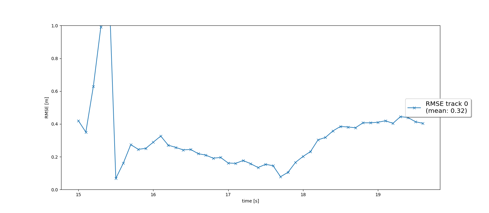
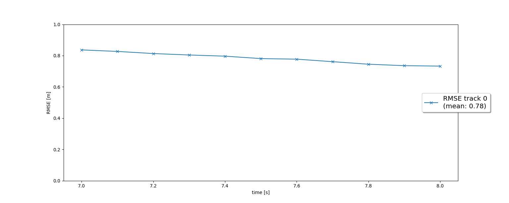
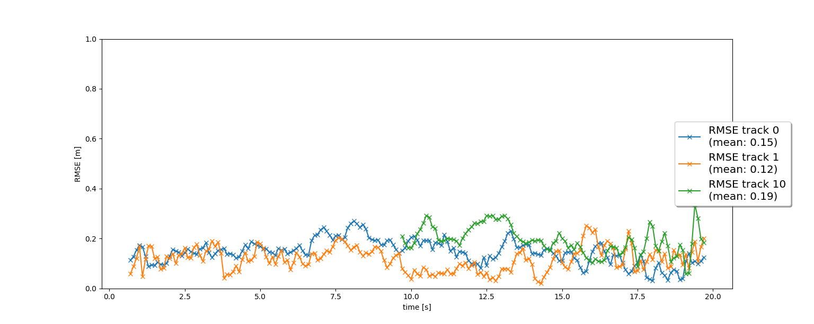

# Writeup: Track 3D-Objects Over Time
### Reference
* Exercises of this nano degree

### 1. Write a short recap of the four tracking steps and what you implemented there (filter, track management, association, camera fusion). Which results did you achieve? Which part of the project was most difficult for you to complete, and why?

#### Filter
In nanodegree lesson we already implemented an 4 dimensional state filter. For this step I first created state transition matrix F for 6d.
Getting process noise covariance Q(t) was some work. I had to do matrix multiplication for 6 dimensions for F*Q*Transpose(F) and then integral over t.

Other methods were simple to implement because I had already finished them during the lesson.

Here is the resulting plot for RMSE.

#### Tracking
It was very simple thanks to instructor of this course. I initialized track with a small score. 
When unassigned track is in sensor’s field of view, I decreased the score.
I used params module to load parameters.
I used different thresholds to delete [initialized and tentative]  and conformed tracks.

Note: After adding camera I had to use different decrement constants, because track 0 was not getting associated from camera.
Here is the RMSE plot.

#### Association
Here we have to associate objects to the measurements. We have multiple tracks and multiple measurements for those objects. 
Deciding which measurement belongs to which object (track) is called association.

To associate tracks to measurements we need to use a distance metric. As learned from the lessons we are using Mahalanobis distance.

We use association matrix which is an N×M matrix that contains the Mahalanobis distances between each track and each measurement.
MHD compares state position with the measurement while considering uncertainty by using inverse of residual covariance S.
For association we used Simple Nearest Neighbor with MHD distance and gatting.
Gatting is used to reduce the calculation because it removes unlikely association pairs.

For this step initialization, MHD, gating and closest track and measurement tasks, I had already finished during lessons. So it was straight forward.

After this task I was able to see multiple tracks and it worked very well without camera.
Here is the RMSE plot.

#### Measurement (Camera)
This was the most challenging part for me. 
I implemented in_fov and get_hx functions properly. But still the results were worse than previous step(with only Lidar).
After some debugging I realized that there was a silly mistake in my Filter, which caused problems only with non linear system.
After fixing that also track 0 was being deleted because it was not getting associated in camera update cycle. I fixed it by having two different thresholds to decrease the score of a track.
I also tried to fix it by having different gating for camera, but there was not much improvement.

Here is the plot for RMSE.

### 2. Do you see any benefits in camera-lidar fusion compared to lidar-only tracking (in theory and in your concrete results)? 
Yes, there are benefits of camera-lidar fusion over lidar only tracking. In theory redundancy is obviously better, because one sensor does not work everywhere 
in every condition. So if one sensor's performance goes down, Its covariance matrix values should go up and it should have less impact on final result. And 
we can rely on other sensors which are working for that moment.
For this specific case I did not see much improvement form camera, probably because in this scenario lidar was already working perfactly and was able to 
track objects properly. On the other hand cameara actually provided some wrong results which were little difficult to fix for me.

Still multiple sensors are better because our scenarios are not fixed. In some other case lidar might give very bad resluts and our tracking might fail if we only have lidar.

### 3. Which challenges will a sensor fusion system face in real-life scenarios? Did you see any of these challenges in the project?
* Oclussion (Visibility) - Objects might be hidden behind large objects and appear suddenly. And then there may not be enough time to associate them with any confirmed track.
* Ghost objects - Sometimes sensors give wrong resluts. This problem is solved by proper tracking and association algorithms.
* Association - One assoication algorithm may not work for all cases. And worse It might be difficult to know when it might fail.
* Callibraiton - All the sensor must be callibrated correctly all the time, which may not be easy to maintain if we have lot of sensors and self driving car is driving continuously day and night.
* Algorithm/Hyperparamters - One algorithm or set of hyperparameters does not work for all the cases. For example driving on a highway with constant speed and emergency braking.
* Computation - Once we have enough redundancy to achieve a certain level of safety, we endup with dozens of sensors convering differnet regions around the car with different ranges. Doing Assoication, Prediction and Update is a challenge in predefined limited cycle time when there might be arbitrary number of objects around the self drving car.

In this project I observed only a few
* Objects from behind were tracked late, because of field of view.
* There were ghost objects.
* Some hyperparameters were different for camera and lidar.

### 4. Can you think of ways to improve your tracking results in the future?
* More sensors to increase field of view and redundancy.
* Fine tuning the parameters for different scenarios, for example with less visibility, snow etc.
* Improving association to make it even faster.
* current association can associate tracks and measurments wrongly. We can improve that.
